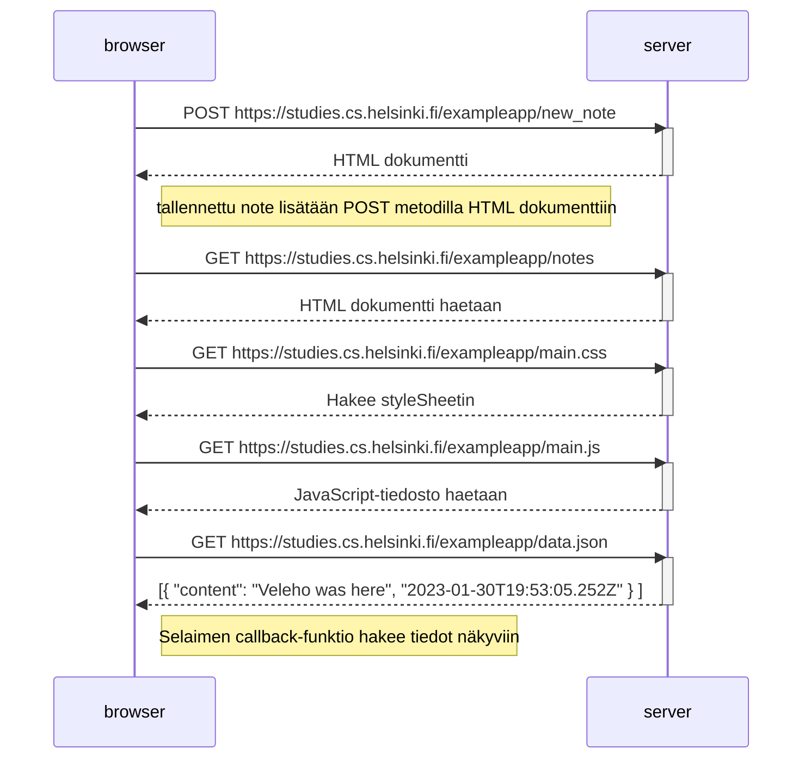

Käyttäjä lisää input-kenttään tekstin "Veleho was here" ja sitten painaa tallenna:

Single Page App-kaavio (kesken)

```mermaid
sequenceDiagram
    participant browser
    participant server
    
    browser->>server: POST https://studies.cs.helsinki.fi/exampleapp/new_note
    activate server
    server-->>browser: HTML dokumentti
    deactivate server
    
    Note right of browser: tallennettu note lisätään POST metodilla HTML dokumenttiin
    
    browser->>server: GET https://studies.cs.helsinki.fi/exampleapp/notes
    activate server
    server-->>browser: HTML dokumentti haetaan
    deactivate server
    
    browser->>server: GET https://studies.cs.helsinki.fi/exampleapp/main.css
    activate server
    server-->>browser: Hakee styleSheetin
    deactivate server
    
    browser->>server: GET https://studies.cs.helsinki.fi/exampleapp/main.js
    activate server
    server-->>browser: JavaScript-tiedosto haetaan
    deactivate server
    
    browser->>server: GET https://studies.cs.helsinki.fi/exampleapp/data.json
    activate server
    server-->>browser: [{ "content": "Veleho was here", "2023-01-30T19:53:05.252Z" } ]
    deactivate server    

    Note right of browser: Selaimen callback-funktio hakee tiedot näkyviin
```
