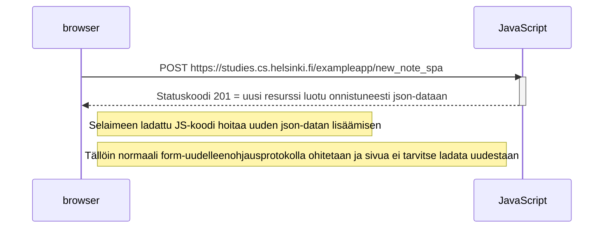

Luodaan uusi muistiinpano spa-sivulla:

Uusi muistiinpano-kaavio

```mermaid
sequenceDiagram
    participant browser
    participant JavaScript
    
    browser->>JavaScript: POST https://studies.cs.helsinki.fi/exampleapp/new_note_spa
    activate JavaScript
    JavaScript-->>browser: Statuskoodi 201 = uusi resurssi luotu onnistuneesti json-dataan
    deactivate JavaScript
    

    Note right of browser: Selaimeen ladattu JS-koodi hoitaa uuden json-datan lisäämisen 
    Note right of browser: Tällöin normaali form-uudelleenohjausprotokolla ohitetaan ja sivua ei tarvitse ladata uudestaan
```
